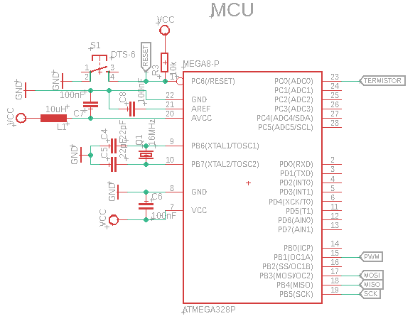
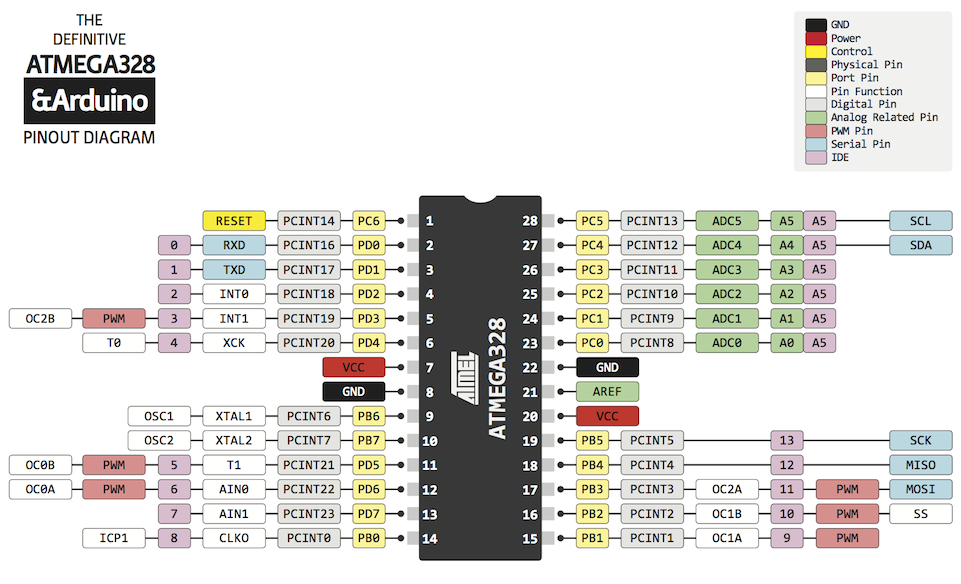
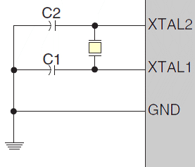
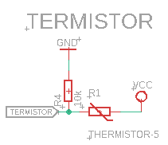
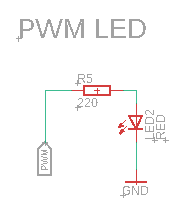

# Projekt - Zmiana natężenia światła emitowanego przez diodę w zależności od temperatury otoczenia. 
# Opis projektu:
Założeniem projektu jest sprawdzanie temperatury otoczenia. Możliwe jest sprawdzanie w szerokim zakresie temperatur. 


# Urzadzenia:
- **Wyjścia:** Dioda LED
- **Wejścia:** Termistor

# Lista elementów projektu:
***
## Mikrokontroler



### 1.  Mikroprocesor - ATMEL ATmega328P


Producent: ATMEL

Typ ukadu scalonego: mikrokontroler AVR

Organizacja pamici Flash: 32kx8bit

Pojemno pamici EEPROM: 1024B

Pojemno pamici SRAM: 2048B

Czstotliwo taktowania: 20MHz

Liczba wej/wyj:	23 

Liczba kanaw PWM: 6 

Liczba timerw 8-bit: 2 

Liczba timerw 16-bit: 1 

Napicie pracy: 1.8...5.5V





### 2. Rezonator kwarcowy 16MHz




***
## Elementy wejścia


### 3.  Termistor
Termistory NTC ze względu gładki przebieg charakterystyki rezystancji w funkcji temperatury, są często stosowane w roli elementów pomiarowych. Układ elektroniczny mierzy rezystancję i na podstawie odpowiednich tabel lub wzorów przelicza uzyskaną wartość na temperaturę. Ich rezystancja może zmieniać się w naprawdę szerokim zakresie.



Termistor NTC 110 10kΩ 5%, 

Typ: NTC

Rezystancja: 10 kΩ dla 25°C

Tolerancja: 5 %

Zakres temperatur: -25...+100°C


***

## Elementy wyjścia


### 4.  Dioda LED RGB


# Kod
```cpp
#include "main.h"
#include <avr/io.h>
#include <util/delay.h> //dodanie bilbioteki związanej z opóźnieniem

int main(void)
{

	DDRB |= (1 << PORTB1); //ustawianie portów wejścia/wyjścia

	TCCR1A |= (1 << COM1A1) | (1 << WGM10); 
	TCCR1B |= (1 << WGM12) | (1 << CS11); 
	//ustawianie trybu timera oraz ustawianie prescalera
	
	OCR1A = 0; //ustawienie wartości porównawczej


	ADMUX |= (1 << REFS0); //ustawianie rejestru multipleksera ADC
	ADCSRA |= (1 << ADPS1) | (1 << ADPS0); //ustawianie preskalera ADC
	ADCSRA |= (1 << ADEN); //włączanie ADC


	int termistor;
	int PWM = 0;

	while (1)
	{
		ADCSRA |= (1 << ADSC); //uruchamianie pomiaru
		loop_until_bit_is_clear(ADCSRA, ADSC); //wykonywanie pętli aż do zmiany rejestru ADSC na 0
		termistor = ADC;

		if ((termistor % 4) == 0)
		{
			PWM = termistor / 4;
		}

		OCR1A = PWM;
		_delay_ms(50);
	}
}
```
